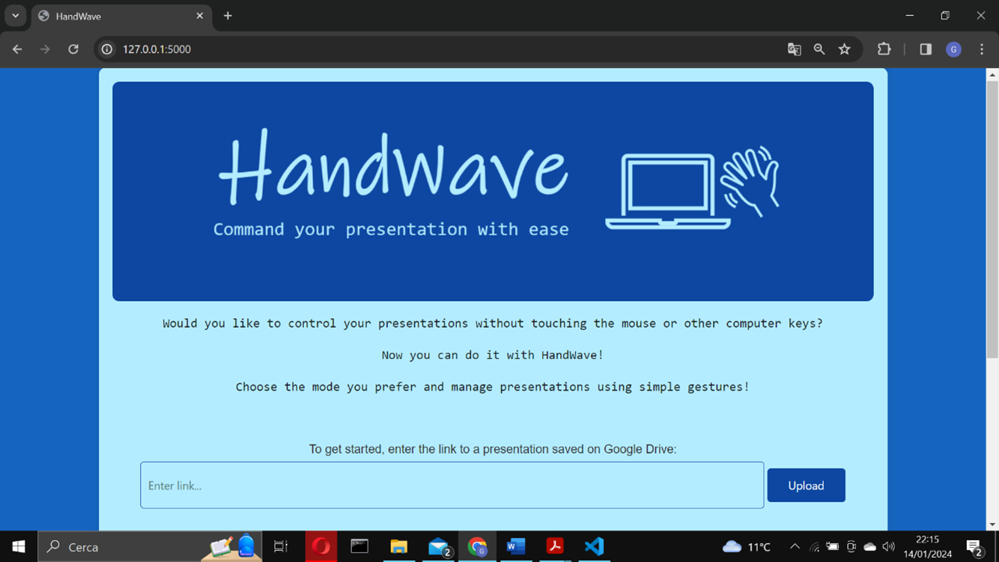
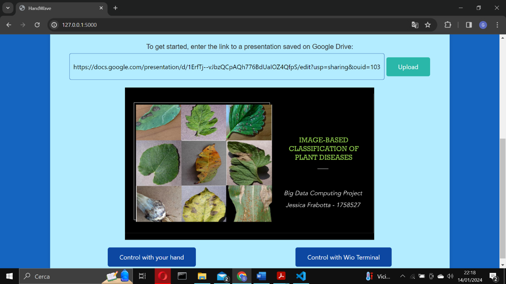
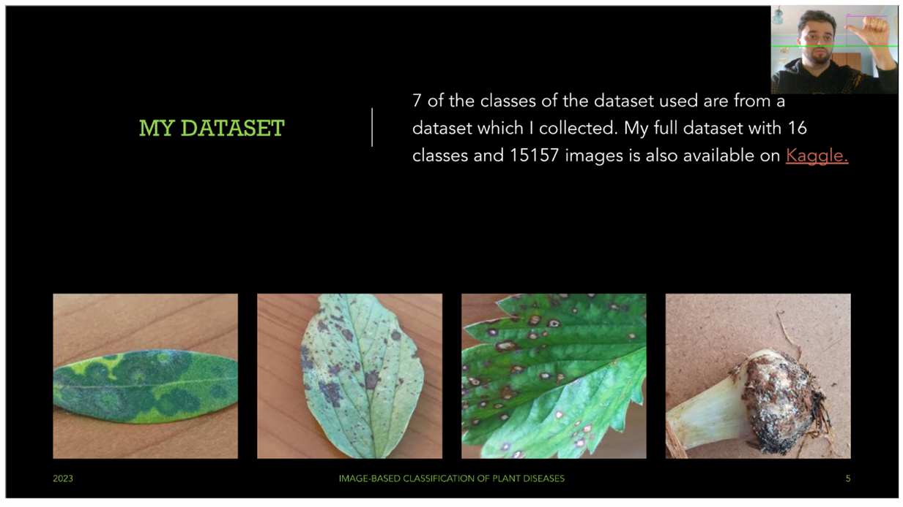
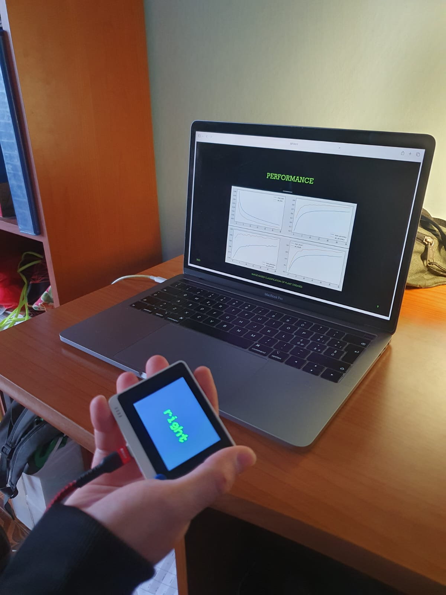

# ✋ Handwave  
**Command your presentation with ease**  

🚀 *A web application that lets you control Google Slides presentations through natural hand gestures.*  

---

## 🌟 Project Motivation  

This project was born from two simple but powerful questions:  
1. 🤔 How can we make controlling a presentation more engaging and natural, beyond traditional mouse clicks and keyboard shortcuts?  
2. 🌌 How can we control a presentation in alternative ways — even at a distance or in the dark?  

The answer led us to create **Handwave**, a web application that enables gesture-based interaction with **Google Slides**.  

With Handwave you can:  
- ⏩ Move forward and backward through slides  
- ✍️ Draw and write annotations directly on slides  
- 🧹 Erase annotations  
- 📺 Toggle full-screen mode  
- 📂 Open and close presentations  

---

## 🖥️ Modes of Interaction  

Handwave offers **two control modes** to adapt to different environments:  

### 1️⃣ Webcam Mode  
- Uses the computer’s webcam to recognize hand gestures ✋  
- Enables **drawing and annotations** directly on slides  
- Best suited for **short/medium distances** from the computer  
- ⚠️ Requires **good lighting conditions** (not always guaranteed in conferences with projectors)  

### 2️⃣ Wio Terminal Mode  
- Uses a **microcontroller (Wio Terminal) with an accelerometer** 📡  
- Allows gesture control **even at a distance** and **in the dark** 🌑  
- ❌ Does not support the annotation feature

  
  

---

## 🧩 Development Process  

### 🔍 Need Finding  
Our first step was to understand users’ needs and expectations for gesture-controlled presentations.  
We conducted **interviews and questionnaires** to collect insights.  

#### Key Questions Included:  
- 👥 Generational and usage context of the user  
- 📊 Last time the user presented slides and in which context  
- 🎯 Crucial actions for controlling a presentation  
- 😊 Positive and negative past experiences with similar technologies  
- 🔒 Privacy concerns: webcam vs. physical device  
- 💡 Willingness to use a gesture-based web application  

---

## 👥 Participants  

- **Interviews:** 17 participants (9 men, 8 women), aged **15–59 years**  
- **Questionnaires:** 115 responses (106 Italians, 9 internationals), 66 men and 49 women  
- Most respondents aged **25–35 years**  

---

## 📊 Key Findings  

- ✅ Most important actions:  
  - Navigating slides (forward/backward)  
  - Annotating on slides  
  - Entering full-screen mode  
  - Opening/closing the presentation  

- 🔒 Privacy:  
  - Most users had **no concern** with webcam usage  
  - Some worried about possible **data storage from the camera**  

- ⚖️ Preference:  
  - No clear preference between **camera-based** or **physical device-based** gesture recognition  
  - Many participants highlighted **advantages and disadvantages** of both approaches  
  - This motivated us to implement **both modes of interaction**, letting users choose the best option depending on the context  

---

## 🛠️ Implemented Tasks  

The following core features were implemented to meet user needs:  

- ⏩ Next slide  
- ⏪ Previous slide  
- ✍️ Annotate (draw) on slides  
- 🧹 Erase annotations  
- 📺 Full-screen mode  
- 📂 Open and load presentation  
- ❌ Close presentation  

Each task was visualized with a **storyboard** for clarity.  

---

## 📝 Design & Prototyping  

Once the main tasks were identified, we moved to **interface design**.  
To quickly test and refine our ideas, we used:  

- 📄 **Paper Prototyping**  
- 🔄 **Iterative testing** with user feedback  

This process allowed us to **gradually improve** the interface design, ensuring it was intuitive and user-friendly.  

---

## 🏗️ Main Implementation Choices  

Handwave was developed with a focus on **simplicity**, **flexibility**, and **usability**.  

- 🌐 **Framework:** [Flask](https://flask.palletsprojects.com/) – a lightweight and flexible Python web framework  
- 📑 **Slides Viewer:** [Google Slides Viewer] – chosen to provide users with a familiar and reliable environment  
  - Supports **pen tool for annotations**, **full-screen mode**, and **slide navigation**  
  - Fully controllable via **keyboard shortcuts**  
- 🔗 At application startup, users are prompted to **provide the Google Slides link** from their Google Drive, enabling them to load and interact with their presentation directly.  

---

## ✋ Gesture Detection via Webcam  

### 🛠️ Libraries & Tools  
- 📷 **OpenCV**: used to preprocess frames and draw a horizontal **green line** on each frame  
- 🖐️ **MediaPipe HandDetector**:  
  - Detects the exact position of the hand  
  - Identifies **landmarks** (key points on the hand), the **hand center**, and **finger positions**  

### 🎯 Workflow  
1. For every frame captured, a **green horizontal line** is drawn  
2. If the **hand center** is **above the line**, gesture control is enabled  
   - ❌ This restriction is disabled during drawing, so gestures are recognized anywhere in the camera view  
3. Gestures are mapped to **Google Slides keyboard shortcuts**  

### 🖐️ Gesture Recognition  
- The system analyzes **which fingers are up or down**  
- Both **left and right hands** are supported  
- Each gesture is associated with a **specific action** (e.g., next slide, previous slide, annotate, erase, etc.)  
- 🏠 Users can consult the **gesture list** both on the homepage and during presentation control  

  

---

## 📡 Gesture Detection via Wio Terminal  

### 🔎 Requirements for the Microcontroller  
We needed a device that was:  
- Equipped with an **accelerometer** (to detect speed, angle, and direction of gestures)  
- 💪 Powerful enough to run a **gesture classification model**  
- 🖥️ Provided **visual feedback** through a display  
- 🌍 Capable of **Wi-Fi connectivity** for integration with the web app  

✅ Final Choice: **[Wio Terminal](https://wiki.seeedstudio.com/Wio-Terminal-Getting-Started)**  
- Features all the required components  
- Programmable with **Arduino IDE**

  

---

## 🧠 Machine Learning with Wio Terminal  

### 📊 Data Collection  
- Collected **27 minutes and 30 seconds** of accelerometer data while performing gestures  
- Data stored in **JSON files**  

### 🤖 Model Training  
- Platform: [Edge Impulse](https://edgeimpulse.com/) – designed for **embedded ML**  
- Training Setup:  
  - **30 epochs**  
  - **Learning rate:** 0.001  
- Results:  
  - **99% accuracy** during training  
  - **100% accuracy** on the test set (20% of dataset)  

### ☁️ Cloud Integration  
- Direct cable connection was not practical (distance limitations)  
- Instead, Wio Terminal connects to **Wi-Fi** and sends the **predicted label** to the cloud in real time  
- Platform: **Blynk Cloud** – free, reliable, and efficient for IoT integration  

---

## 🔄 Web Application & Cloud Communication  

- Handwave makes **cyclical HTTP GET requests** to **Blynk Cloud**  
- Retrieves the **gesture label** predicted by Wio Terminal  
- Each label triggers a **Google Slides keyboard shortcut**, just like webcam-based gestures  

---

## 🧪 User Testing & Evaluation  

### 📋 Testing Approach  
- Early testing began with **paper prototypes**, allowing quick iteration  
- Evaluation Technique: **Cooperative Evaluation**  
  - Users performed tasks  
  - Thought aloud while interacting  
  - Asked questions directly to the developers  

### 👥 Participants  
- **15 people** tested the system  
  - 9 men, 6 women  
  - Ages **15–59 years**  

### ⭐ Results  
- Website judged as:  
  - ✅ **Intuitive**  
  - ✅ **Easy to navigate**  
- Gestures considered:  
  - ⚡ **Efficient**  
  - ⚡ **Responsive**  
- Positive feedback on **both control modes** (webcam & Wio Terminal)  

---

## Authors
- [@Pnlalessio](https://github.com/Pnlalessio)  
- [@JessicaFrabotta](https://github.com/JessicaFrabotta)

---
